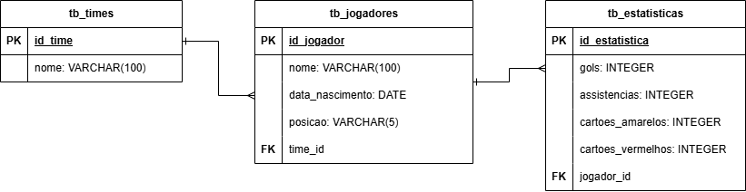

# ENDO - Back-end para Gerenciamento de Times, Jogadores e Estatísticas ⚽📊

Este é o **back-end** do sistema **INAZUMA**, nomeado **ENDO**. Ele oferece uma API RESTful para gerenciar **times de futebol**, **jogadores** e suas **estatísticas**. Através dessa API, é possível realizar operações de CRUD (criação, leitura, atualização e exclusão) para gerenciar times, jogadores e suas estatísticas associadas.

---

## Público-Alvo 🎯

Este back-end é destinado a:

- **Desenvolvedores Front-End** que irão consumir a API para construir o painel de controle ou interface do usuário.
- **Gerenciadores de Times e Organizadores de Torneios** que utilizam a API para integrar com outras plataformas.
- **Equipes de Suporte e Administração** que precisam manter a integridade dos dados de times, jogadores e suas estatísticas.

---

## Funcionalidades da API

### CRUD de Times 🏆

- **Criar:** Permite adicionar novos times com informações como nome e cidade.
- **Ler:** Recupera a lista de todos os times cadastrados.
- **Atualizar:** Atualiza informações dos times (nome, cidade).
- **Deletar:** Remove um time do sistema.

### CRUD de Jogadores 👟

- **Criar:** Permite adicionar novos jogadores com informações como nome, data de nascimento, posição e time associado.
- **Ler:** Recupera a lista de todos os jogadores cadastrados ou informações de um jogador específico.
- **Atualizar:** Atualiza as informações dos jogadores (nome, data de nascimento, posição).
- **Deletar:** Remove um jogador do sistema.

### CRUD de Estatísticas 📈

- **Criar:** Adiciona estatísticas para um jogador, como gols, assistências, cartões amarelos/vermelhos, etc.
- **Ler:** Recupera as estatísticas de um jogador específico.
- **Atualizar:** Atualiza as estatísticas existentes para um jogador.
- **Deletar:** Remove estatísticas de um jogador.

---

## Tecnologias Utilizadas 🛠️

- **Back-end:** **PHP** puro, utilizando PDO para interações com o banco de dados.
- **Banco de Dados:** **PostgreSQL** para persistência de dados.

---

## DER (Diagrama de Entidades e Relacionamentos) 📊

---

## Link Front-End 

 - https://github.com/FelipeBragaValotaEsteves/goenji

